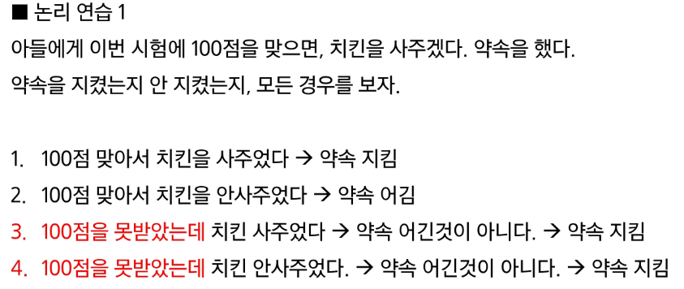

# 컴퓨팅 사고력🎱

> ### 직관과 논리
> - 직관 : 무의식적이고 즉각적인 사고 과정, 명확한 논리적 추론없이 결론에 도달하는 것
>      - 경험, 감정, 잠재의식에 의존하는 사고 방식
> - 논리 : 명확한 규칙과 절차를 통해 사고를 전개하는 과정
>      - 일련의 단계적 추론 과정을 통해 결론에 도달하는 것

> 
>> - 첫번째는 둘 중 하나만 있으면 합격, 둘 다 있어도 합격이라는 뜻 (Inclusive OR, OR)
>> - 두번째는 둘 중 하나만 준다는 것, 둘 다 준다는 것이 아님 (Exclusive OR, XOR)

> 
>> - 3번 : 다른 이유로 치킨을 사줄 수 있으므로 약속을 어긴 것이 아님
>> 가정(시험을 100점 맞으면)이 거짓이면, 전제는 항상 참(치킨을 사주겠다)이 된다.

> ### 명제란?
> - 참 혹은 거짓을 명확히 판별할 수 있는 문장
>> 예시)
>> - 2는 짝수이다 (명제, 참)
>> - 5는 10보다 크다 (명제, 거짓)
>> - 오늘 수업은 재밌다. (명제 x - 주관적인 표현, 사람마다 다른 결론이 나온다.)
>> - 서울은 대한민국의 수도이다. (명제, 참)
>> - 즐겁게 수업 들으세요. (명제 x, 명령문, 권유문, 질문문 -> 참 거짓 평가가 불가함)

> ### 조건 명제
> - 두 명제 사이에 조건을 부여하는 표현
> - p → q 로 표현한다 (if문 과 비슷함)
> - (전건) p : 조건이 되는 명제 (만약 p라면)
> - (후건) q : 조건이 충족될 때 결과로 나오는 명제 (q이다.)
>> 예시)
>> - 비가 온다면 땅이 젖는다.
>> - p : 비가 온다. or 오지 않는다.
>> - q : 땅이 젖는다. or 젖지 않는다.
> - 조건 명제와 추가적인 명제
>> - 역(Converse) : 조건 명제의 전건과 후건을 서로 바꾼 명제
>>      - 1. p → q
>>      - 2. 예시) 만약 땅이 젖으면 비가 온다.
>>      - 3. 조건명제가 참이라도, 참이 아닐 수 있다.
>>      - 4. 사용 사례: 원래 조건 명제의 반대 방향을 추론하고자 할 때 사용
>>          - 1. 직사각형이면 네 각이 모두 직각
>>          - 2. 네 각이 모두 직각이면 직사각형이다.
>> - 이(Inverse) :  조건 명제의 전건과 후건을 각각 부정한 명제
>>      - 1. ~p → ~q
>>      - 2. 만약 p가 아니면, q도 아니다
>>      - 3. 예시) 만약 비가 오지 않으면, 땅이 젖지 않는다.
>>      - 4. 조건 명제가 참이라도, 참이 아닐 수 있다.
>>      - 5. 논리적으로 원래 명제와 부정된 상황에서 참인지 거짓인지 확인하는데 사용
>> - 대우(Contrapositive) : 조건명제의 전건과 후건을 서로 바꾸고, 각각 부정한 명제
>>      - 1. ~q → ~p
>>      - 2. 만약 q가 아니면, p도 아니다
>>      - 3. 예시) 만약 땅이 젖지 않으면, 비가 오지 않는다.
>>      - 4. 원래 조건 명제와 항상 동일한 진리값을 가진다!
>>          - 1. 대우가 참임을 증명하면 원래 명제도 참임(간접 증명)

> ### 진리표(Truth Table)
> - 논리식이나 논리 연산의 모든 가능한 입력 조합과 그에 따른 출력을 보여주는 표

> ### 증명방법
>> - 직접 증명 : 조건에서 바로 결론을 도출하는 증명
>>      - 예시) 짝수의 합은 항상 짝수이다.
>> 간접 증명(귀류법) : 결론이 거짓이라고 가정하여 모순을 유도하는 방
>>      - 예시) 루트2는 유리수가 아니다.
>>          - 시작: 루트2가 유리수다 라고 가정 → a/b 식으로 나타낼 수 있어야 한다.
>> 대우를 이용한 증명
>> 수학적 귀납법