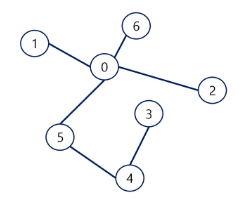

# 백트래킹(Backtracking) 🌠

> ## 개념
> - 여러 가지 선택지(옵션)들이 존재하는 상황에서 한가지를 선택
> - 선택이 이루어지면 새로운 선택지들의 집합이 생성
> - 선택을 반복하면서 최종 상태에 도달 (올바른 선택을 계속하면 목표에 도달)

> ### 백트래킹과 깊이 우선 탐색과의 차이
> - 어떤 노드에서 출발하는 경로가 해결책으로 이어질 것 같지 않으면 더 이상 그 경로를 따라가지 않음으로써 시도 횟수를 줄임 (Prunning 가지치기)
> - 깊이 우선 탐색이 모든 경로를 추적하는데 비해 백트래킹은 불필요한 경로를 조기에 차단
> - 깊이 우선 탐색을 가하기에는 경우의 수가 너무 많음. N! 가지의 경우의 수를 가진 문제는 처리 불가능
> - 백트래킹 알고리즘을 적용하면 경우의 수는 줄지만 최악의 경우에는 지수함수 시간을 요하므로 처리 불가능

> ### 절차
> - 1. 상태 공간 트리의 깊이 우선 검색을 실시
> - 2. 각 노드가 유망한지(설계 단계에서 유망하지 않은 경우를 생각하고 구현)
> - 3. 노드가 유망하지 않으면, 그 노드의 부모 노드로 돌아가서 검색을 계속한다.

```
queen 문제 

def check(row):
    for col in range(row):
        if visited[row] == visited[col]:
            return False

        # 열과 행의 차이가 같다 == 현재 col 의 좌우 대각선이다
        if abs(visited[row] - visited[col]) == abs(row - col):
            return False

    return True


def dfs(row):
    global cnt

    if row == N:
        cnt += 1
        return

    for col in range(N):
        # visited[row][col] = 1      이렇게 사용 x
        # 이차원 배열을 사용하지않고 해당 행의 몇번 째 열에 배치 했다라고 visited 표시        
        visited[row] = col
        if not check(row):
            continue

        dfs(row + 1)

T = int(input())
for tc in range(1, T + 1):
    N = int(input())
    visited = [0] * N
    cnt = 0

    dfs(0)
    print(f'#{tc} {cnt}')
```


```
arr = [i for i in range(1, 11)]
visited = []

def dfs(level, sum):

if 


dfs(0, 0)

```
---
---

# 트리(Tree) 🏝

> ## 개념
> 
> 
> - 싸이클이 없는 무향 연결 그래프이다(==양방향)
>   - 두 노드 사이에는 유일한 경로가 존재한다. (==싸이클이 없음)
>   - 각 노드는 최대 하나의 부모 노드가 존재할 수 있다.
>   - 각 노드는 자식 노드가 없거나 하나 이상이 존재할 수 있다.
> 
> - 비선형 구조
>   - 원소들 간에 1:n 관계를 가지는 자료구조
>   - 원소들 간에 계층관계를 가지는 계층형 자료구조 (루트는 상황에 따라 다름)

---
---

# 이진 트리 - 순회(traversal) 🛫

> ## 개념
> - 트리의 각 노드를 중복되지 않게 전부 방문하는 것
> - 트리는 비 선형 구조이기 때문에 선형구조에서와 같이 선후 연결 관계를 알 수 없음

---
---

# 힙(heap) 🛫

> ## 개념
> - 완전 이진 트리에 있는 노드 중에서 키 값이 가장 큰 노드나 키 값이 가장 작은 노드를 찾기 위해서 만든 자료구조
> - 최대 힙 : 키 값이 가장 큰 노드를 찾기 위한 완전 이진 트리
> - 최소 힙 : 키 값이 가장 작은 노드를 찾기 위한 완전 이진 트리
> - 루트 노드의 원소만을 삭제할 수 있다.
> - 루트 노드의 원소를 삭제하여 반환