# 그래프(Graph) 🗼

> ### 개념
> - 아이템(사물 또는 추상적 개념)들과 이들 사이의 연결 관계를 표현
> - 정점(Vertex) 집합과 이들을 연결하는 간선(Edge)들의 집합으로 구성된 자료구조
> - 선형 자료구조나 트리 자료구조로 표현하기 어려운 N:N 관계를 가지는 원소를 표현하기 용이

> ### 그래프 유형
> 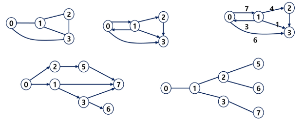
> - 무향 그래프(Undirected Graph) : 친구
> - 유향 그래프(Directed Graph) : 도로(양방향), 지하철, (편도로 생각나는 것들) 팔로우
> - 가중치 그래프(Weighted Graph)[유향 무향 둘 다 가능] : 도로건설(비용), 비행기(금액), 계단 서로 연결되어 있는데 비용이 드는 것
> - 사이클 없는 방향 그래프(DAG, Directed Acyclic Graph) : 트리
>
> 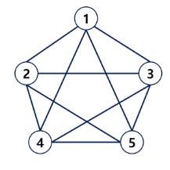
> - 완전 그래프 : 정점들에 대해 가능한 모든 간선들을 가진 그래프
> - 부분 그래프 : 원래 그래프에서 일부 정점이나 간선을 제외한 그래프

> ### 그래프 경로
> - 간선들을 순서대로 나열한 것
> - 경로 중 한 정점을 최대한 한번만 지나는 경로를 단순경로라 함.
> - 시작한 정점에서 끝나는 경로를 사이클이라고 함.

> ### 그래프 표현
> - 간선의 정보를 저장하는 방식, 메모리나 성능을 고려해서 결정 <br/>
> - 1. 인접 행렬 : 2차원 배열을 이용해서 간선 정보를 저장 
>>  - 장점 : 연결 여부를 한 번에 탐색 가능 (연결이 안되어 있다 라는 정보도 함께 저장)
>>  - 단점 : 메모리 낭비가 심하다.
> - 2. 인접 리스트 : 각 정잠마다 해당 정점으로 나가는 간선의 정보를 저장 
>>  - 장점 : 메모리 활용이 효율적
>>  - 단점 : 연결 정보 확인이 어렵다. (연결 된 정보만 저장)
> - 3. 간선의 배열 : 간선(시작 정점, 끝 정점)을 배열에 연속적으로 저장


> ### 인접 리스트
> 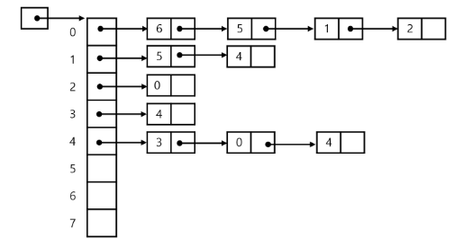
> - 하나의 정점에 대한 인점 정점들을 각 연결 리스트로 저장 (삽입 삭제가 많기 때문)
>> - 무방향 그래프 : 노드수 = 간선의 수 * 2
>> - 방향 그래프 : 노드 수 = 간선의 수
> 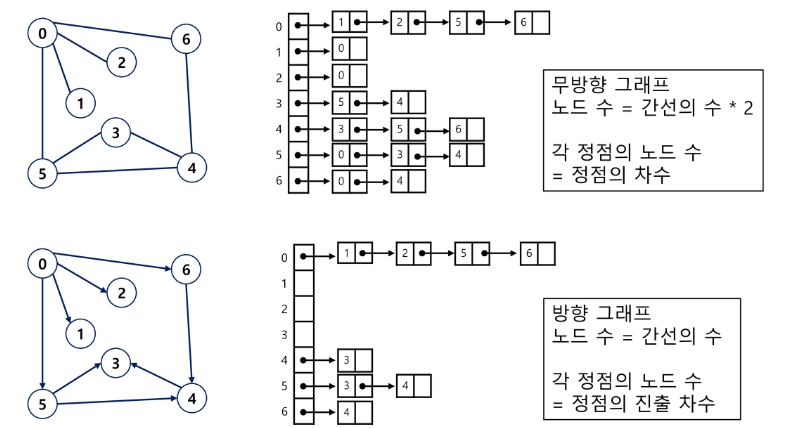


> - 그래프 순회 : 비선형구조인 그래프로 포현된 모든 정점을 빠짐없이 탐색하는 것
> 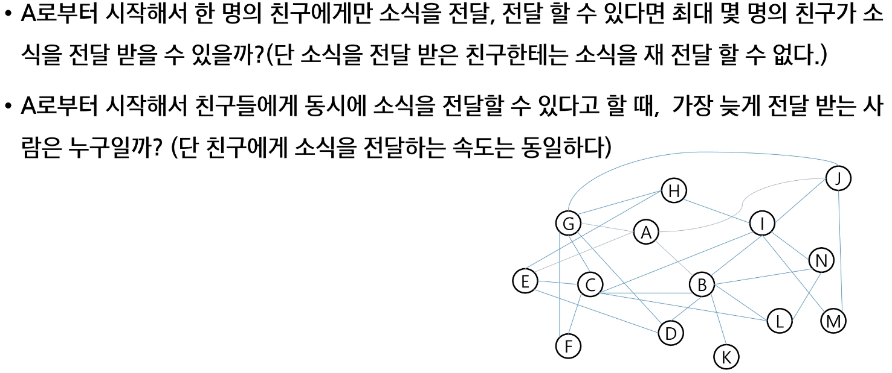
> - 끌까지 전달을 해봐야 1번 계산 가능, 경우의 수를 다 보자 (DFS)
> - 퍼져나가면서 문제가 해결 (BFS)

---
---

# 깊이 우선 탐색(Depth First Search, DFS) 🛩

> ### 개념
> - 시작 정점의 한 방향으로 갈 수 있는 경로가 있는 곳까지 깊이 탐색해 가다가 더 이상 갈 곳이 없게 되면, 가장 마지막에 만났던 갈림길 간선이 있는 정점으로 되돌아와서 다른 방향의 정점으로 탐색을 계속 반복하여 결국 모든 정점을 방문하는 순회방법
> - 가장 마지막에 만났던 갈림길의 정점으로 되돌아가서 다시 깊이 우선 탐색을 반복해야 하므로 후입선출 구조의 스택 사용

```

# 시작점 : 1번부터 시작
# 끝점 : 1번에서 갈 수 있는 모든 정점을 방문하면 종료
(visited 처리 덕분에, 기저조건 없이도 자연스럽게 종료됨)

def dfs(node):
    print(node, end=' ')  # 현재 노드 출력

    # 현재 정점에서 연결되어 있는 노드들을 탐색
    for next_node in graph[node]:
        if visited[next_node]:      # 이미 방문했다면 통과
            continue

        visited[next_node] = 1      # 방문처리
        dfs(next_node)              # 다음 정점으로 이동


N, M = map(int, input().split())
# 비어있는 리스트를 N + 1번 반복하면서 생성
# 1. 비어있는 리스트 : 아직 갈 수 있는 곳이 없다.
# 2. N + 1 번 : 0번 인덱스를 버린다. (문제에서 노드번호가 1번부터 시작)
# ---> 인접리스트를 만들기 위해 아래와 같이 정의

graph = [[] for _ in range(N + 1)]   

# 연결 정보를 저장
visited = [0] * (N + 1)
for _ in range(M):
    s, e = map(int, input().split())
    # 양방향 그래프이므로, 시작 <-> 끝점을 바꾸면서 저장
    graph[s].append(e)
    graph[e].append(s)  # 문제가 방향 그래프라면, 바꾼 정보를 저장하면 버그남!

visited[1] = 1      # 출발지 방문처리
dfs(1)

```
---
---

# 너비 우선 탐색(Breadth First Search, BFS) 🛩

> ### 개념
> - 탐색 시작점의 인접한 정점들을 먼저 모두 차례로 방문한 후에, 방문했던 점을 시작점으로 하여 다시 인접한 정점들을 차례대로 방문하는 방식
> - 인접한 정점들에 대해 탐색을 한 후, 차례로 다시 너비우선탐색을 진행해야 하므로, 선입선출 형태의 자료구조인 큐를 활용함
> 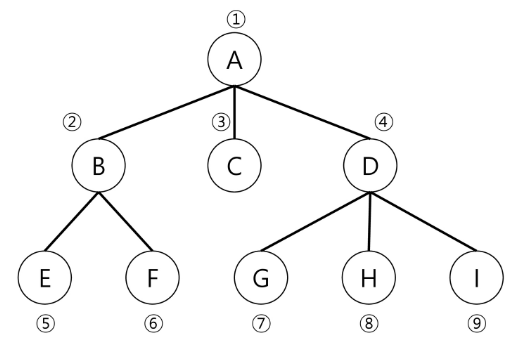


```
def bfs(node):
    q = [node]     

    # q 에 저장되는 데이터 : 다음에 처리할 데이터(후보군)
    while q:
        now = q.pop(0)

        print(now, end=' ')  # 현재 노드 출력

        for next_node in graph[now]:
            if visited[next_node]:  # 이미 방문한 정점이면 통과
                continue

            visited[next_node] = 1  # 방문 처리
            q.append(next_node)     # 후보군에 추가(순서가 되면 처리)

# 핵심 : 어떤 노드를 먼저 탐색할 것인가
#   - 특정 정점을 기준으로 퍼져나가면서 확인
N, M = map(int, input().split())
graph = [[] for _ in range(N + 1)]
visited = [0] * (N + 1)
for _ in range(M):
    s, e = map(int, input().split())
    graph[s].append(e)
    graph[e].append(s)

visited[1] = 1
bfs(1)
```
---
---
# Union - Find 🎡

> ### Disjoint_sets (서로소 집합)
> - 서로소 또는 상호베타 집합들은 서로 중복 포함된 원소가 없는 집합, 교집합이 없음
> - 집합에 속한 하나의 특정 멤버를 통해 각 집합들을 구분 => 대표자(representative)

> ### 상호베타 집합을 표현하는 방법
> - 연결 리스트
> - 트리
>> - 상호베타 집합 연산
>> - Make-Set(x) : 초기 설정
>> - Find-Set(x) : 대표자가 누구일까?
>> - Union(x, y) : 같은 그룹으로 묶어주기
>
> 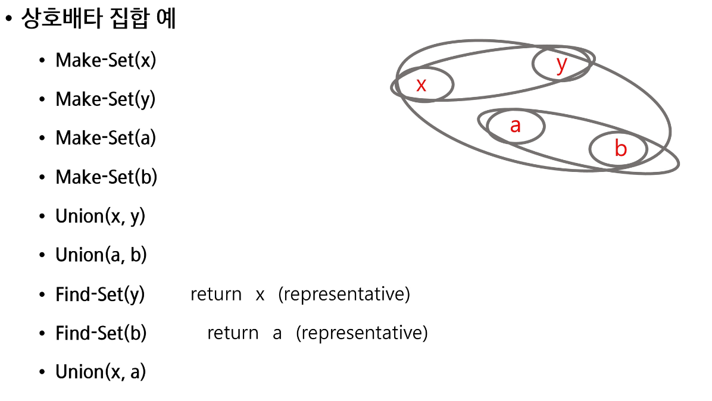

> ### 연결리스트
> - 같은 집합의 원소들은 하나의 연결리스트로 관리
> - 맨 앞의 원소를 집합의 대표 원소로 삼는다.
> - 각 원소는 집합의 대표원소를 가리키는 링크를 갖는다.
> 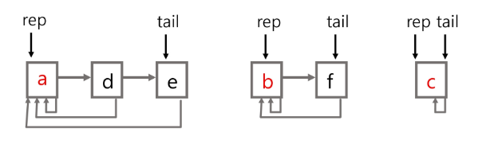

> ### 트리
> - 하나의 집합을 하나의 트리로 표현
> - 자식 노드가 부모 노드를 가리키며 루트 노드가 대표자가 된다.
> 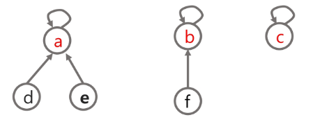
>
>> 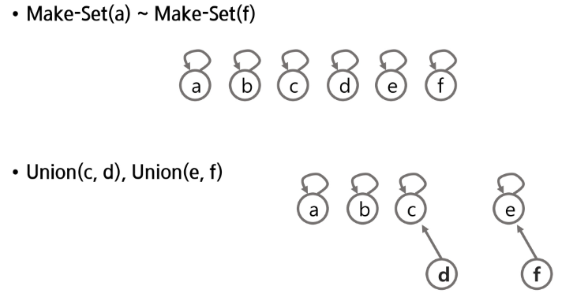
>> 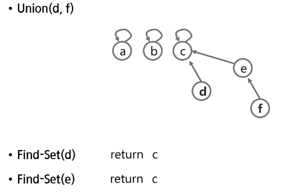
>> 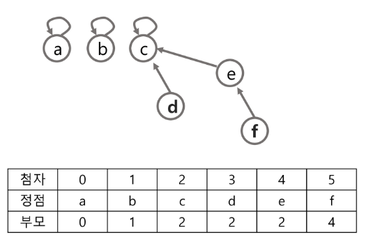
> >> - 대표자끼리 연결하여 바라보게 하는 것

```
# 자기 자신을 가르키도록 만들기
def make_set(n):
    p = [i for i in range(n)]  # 각 원소의 부모를 자신으로 초기화
    return p


def find(x):
    if parents[x] == x:        # x 자기 자신이 x를 바라봄 == 해당 집합의 대표자를 찾았다 
        return x

    # x의 부모가 가리키고 있는 정점부터 다시 대표자를 탐색
    return find(parents[x])


def union(x, y):
    # x, y의 대표자를 찾자
    root_x = find(x)
    root_y = find(y)

    if root_x == root_y:  # 이미 같은 집합이면 끝 (같은 집합이면 union 연산 하지 않음)
        return

    # 다른 집합이라면 더 작은 루트노트에 합친다.
    # 문제에 따라 다르지만(우선은 더 작은 노드로 합쳐줌)
    if root_x < root_y:
        parents[y] = root_x     # y가 바라보는 부모는 x의 대표자
    else:
        parents[x] = root_y


# 예제 사용법
n = 7  # 원소의 개수
parents = make_set(n)

union(1, 3)         # 1의 대표자 3의 대표자를 합치는 과정
union(2, 3)
union(5, 6)

# 변하는 것은 항상 parents, 진행 사항을 알 수 있음.
print(parents)      # 대표자의 수 == 집합의 수

print('find_set(6) = ', find(6))

target_x = 2
target_y = 3

# 원소 1과 원소 2가 같은 집합에 속해 있는지 확인
if find(target_x) == find(target_y):
    print(f"원소 {target_x}과 원소 {target_y}는 같은 집합에 속해 있습니다.")
else:
    print(f"원소 {target_x}과 원소 {target_y}는 다른 집합에 속해 있습니다.")
```

> - 위 코드의 문제점
> 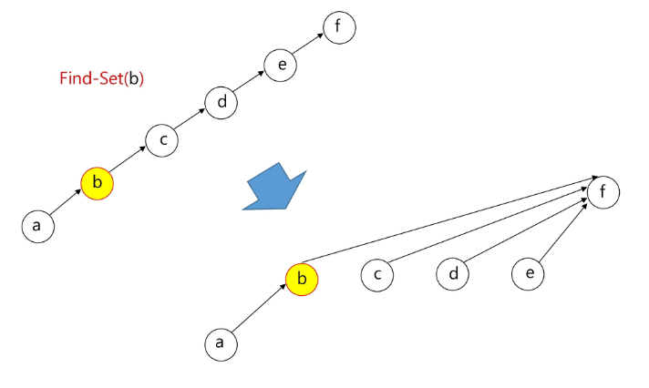


> ### Path Compression의 예시
> 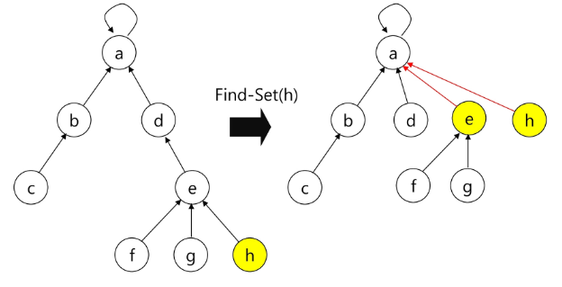
> - d가 가리키는 부모가 대표자면 리턴으로 e가 바로 가리킬 수 있도록 수정

```
# 자기 자신을 가르키도록 만들기
def make_set(n):
    p = [i for i in range(n)]  # 각 원소의 부모를 자신으로 초기화
    return p


def find(x):
    if parents[x] == x:        # x 자기 자신이 x를 바라봄 == 해당 집합의 대표자를 찾았다 
        return x

# 이부분만 수정하면 경로 압축으로 수정 끝

    # x의 부모가 가리키고 있는 정점부터 다시 대표자를 탐색
    # return find(parents[x])

    #parents[x]              # x가 가리키고 있는 부모
    #find(parents[x])        # x 의 부모로부터 대표자를 찾기
    
    parents[x] = find(parents[x])
    return parents[x]

def union(x, y):
    # x, y의 대표자를 찾자
    root_x = find(x)
    root_y = find(y)

    if root_x == root_y:  # 이미 같은 집합이면 끝 (같은 집합이면 union 연산 하지 않음)
        return

    # 다른 집합이라면 더 작은 루트노트에 합친다.
    # 문제에 따라 다르지만(우선은 더 작은 노드로 합쳐줌)
    if root_x < root_y:
        parents[y] = root_x     # y가 바라보는 부모는 x의 대표자
    else:
        parents[x] = root_y


# 예제 사용법
n = 7  # 원소의 개수
parents = make_set(n)

union(1, 3)         # 1의 대표자 3의 대표자를 합치는 과정
union(2, 3)
union(5, 6)

# 변하는 것은 항상 parents, 진행 사항을 알 수 있음.
print(parents)      # 대표자의 수 == 집합의 수

print('find_set(6) = ', find(6))

target_x = 2
target_y = 3

# 원소 1과 원소 2가 같은 집합에 속해 있는지 확인
if find(target_x) == find(target_y):
    print(f"원소 {target_x}과 원소 {target_y}는 같은 집합에 속해 있습니다.")
else:
    print(f"원소 {target_x}과 원소 {target_y}는 다른 집합에 속해 있습니다.")
```

> ### Rank를 이용한 Union
> 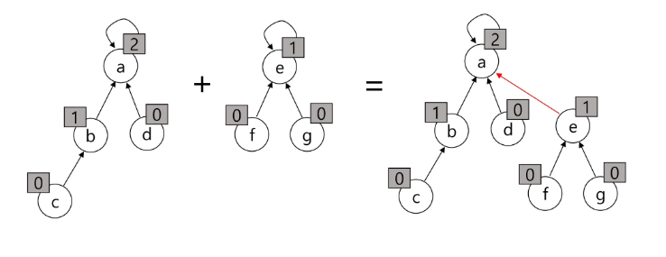
> - subtree의 높이를 랭크(rank)라는 이름으로 저장
> - 두 집합을 합칠 때 rank가 낮은 집합을 rank가 높은 집합에 붙임
> - 사용하는 이유 : 그래프의 경우에서 이미 연결된 노드끼리 또 연결하면 사이클이 발생(특이한 상황이 발생함)

```
def make_set(n):
    p = [i for i in range(n)]  # 각 원소의 부모를 자신으로 초기화
    r = [0] * n                # 시작 rank는 모두 0으로 초기화
    return p, r


def find(x):
    # 원소의 부모가 자기자신이다 == 자기가 그 그룹의 대표자
    if parents[x] == x:
        return x

    # 경로 압축 (path compression)을 통해 부모를 루트로 설정
    parents[x] = find(parents[x])
    return parents[x]


def union(x, y):
    root_x = find(x)
    root_y = find(y)

    if root_x == root_y:  # 이미 같은 집합이면 끝
        return

    # # rank를 비교하여 더 작은 트리를 큰 트리 밑에 병합
    if ranks[root_x] > ranks[root_y]:
        parents[root_y] = root_x
    elif ranks[root_x] < ranks[root_y]:
        parents[root_x] = root_y
    else:
        # rank가 같으면 한쪽을 다른 쪽 아래로 병합하고 rank를 증가시킴
        parents[root_y] = root_x
        ranks[root_x] += 1


# 예제 사용법
n = 7  # 원소의 개수
parents, ranks = make_set(n)

union(1, 3)
union(2, 3)
union(5, 6)

print('find_set(6) = ', find(6))

target_x = 2
target_y = 3

# 원소 1과 원소 2가 같은 집합에 속해 있는지 확인
if find(target_x) == find(target_y):
    print(f"원소 {target_x}과 원소 {target_y}는 같은 집합에 속해 있습니다.")
else:
    print(f"원소 {target_x}과 원소 {target_y}는 다른 집합에 속해 있습니다.")

```