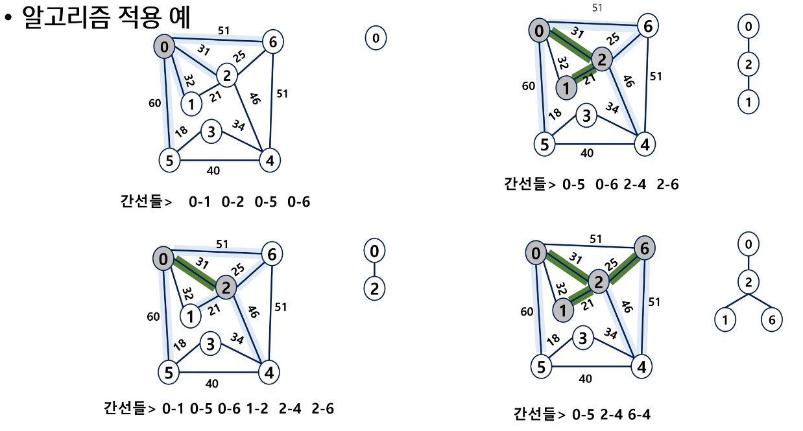
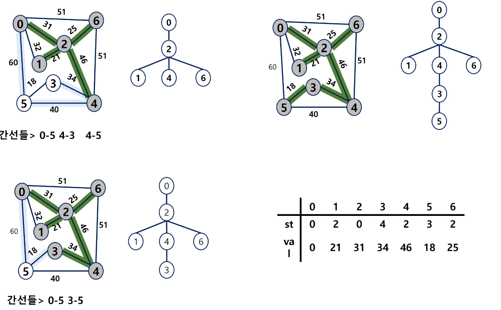
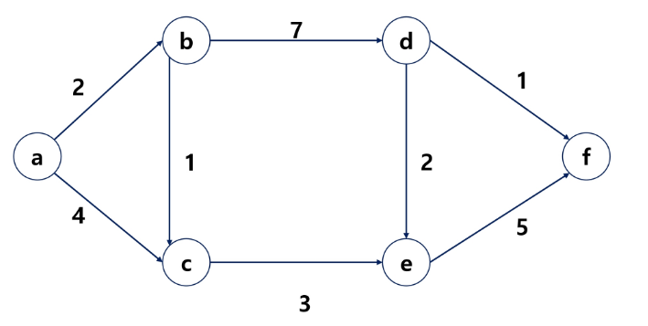
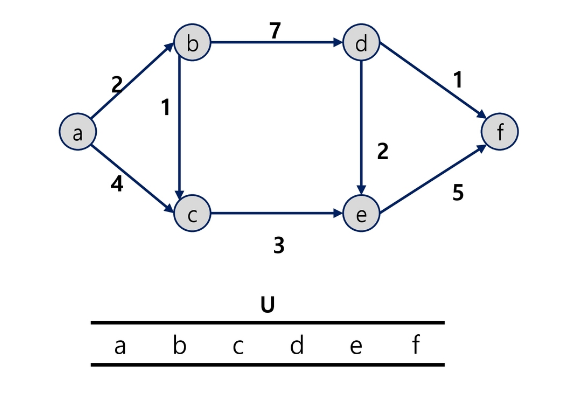

# 그래프(Graph) 🗼

> ### 개념
> - 아이템(사물 또는 추상적 개념)들과 이들 사이의 연결 관계를 표현
> - 정점(Vertex) 집합과 이들을 연결하는 간선(Edge)들의 집합으로 구성된 자료구조
> - 선형 자료구조나 트리 자료구조로 표현하기 어려운 N:N 관계를 가지는 원소를 표현하기 용이

> ### 그래프 유형
> 
> - 무향 그래프(Undirected Graph) : 친구
> - 유향 그래프(Directed Graph) : 도로(양방향), 지하철, (편도로 생각나는 것들) 팔로우
> - 가중치 그래프(Weighted Graph)[유향 무향 둘 다 가능] : 도로건설(비용), 비행기(금액), 계단 서로 연결되어 있는데 비용이 드는 것
> - 사이클 없는 방향 그래프(DAG, Directed Acyclic Graph) : 트리
>
> 
> - 완전 그래프 : 정점들에 대해 가능한 모든 간선들을 가진 그래프
> - 부분 그래프 : 원래 그래프에서 일부 정점이나 간선을 제외한 그래프

> ### 그래프 경로
> - 간선들을 순서대로 나열한 것
> - 경로 중 한 정점을 최대한 한번만 지나는 경로를 단순경로라 함.
> - 시작한 정점에서 끝나는 경로를 사이클이라고 함.

> ### 그래프 표현
> - 간선의 정보를 저장하는 방식, 메모리나 성능을 고려해서 결정 <br/>
> - 1. 인접 행렬 : 2차원 배열을 이용해서 간선 정보를 저장 
>>  - 장점 : 연결 여부를 한 번에 탐색 가능 (연결이 안되어 있다 라는 정보도 함께 저장)
>>  - 단점 : 메모리 낭비가 심하다.
> - 2. 인접 리스트 : 각 정잠마다 해당 정점으로 나가는 간선의 정보를 저장 
>>  - 장점 : 메모리 활용이 효율적
>>  - 단점 : 연결 정보 확인이 어렵다. (연결 된 정보만 저장)
> - 3. 간선의 배열 : 간선(시작 정점, 끝 정점)을 배열에 연속적으로 저장


> ### 인접 리스트
> 
> - 하나의 정점에 대한 인점 정점들을 각 연결 리스트로 저장 (삽입 삭제가 많기 때문)
>> - 무방향 그래프 : 노드수 = 간선의 수 * 2
>> - 방향 그래프 : 노드 수 = 간선의 수
> 


> - 그래프 순회 : 비선형구조인 그래프로 포현된 모든 정점을 빠짐없이 탐색하는 것
> 
> - 끌까지 전달을 해봐야 1번 계산 가능, 경우의 수를 다 보자 (DFS)
> - 퍼져나가면서 문제가 해결 (BFS)

---
---

# 깊이 우선 탐색(Depth First Search, DFS) 🛩

> ### 개념
> - 시작 정점의 한 방향으로 갈 수 있는 경로가 있는 곳까지 깊이 탐색해 가다가 더 이상 갈 곳이 없게 되면, 가장 마지막에 만났던 갈림길 간선이 있는 정점으로 되돌아와서 다른 방향의 정점으로 탐색을 계속 반복하여 결국 모든 정점을 방문하는 순회방법
> - 가장 마지막에 만났던 갈림길의 정점으로 되돌아가서 다시 깊이 우선 탐색을 반복해야 하므로 후입선출 구조의 스택 사용

```

# 시작점 : 1번부터 시작
# 끝점 : 1번에서 갈 수 있는 모든 정점을 방문하면 종료
(visited 처리 덕분에, 기저조건 없이도 자연스럽게 종료됨)

def dfs(node):
    print(node, end=' ')  # 현재 노드 출력

    # 현재 정점에서 연결되어 있는 노드들을 탐색
    for next_node in graph[node]:
        if visited[next_node]:      # 이미 방문했다면 통과
            continue

        visited[next_node] = 1      # 방문처리
        dfs(next_node)              # 다음 정점으로 이동


N, M = map(int, input().split())
# 비어있는 리스트를 N + 1번 반복하면서 생성
# 1. 비어있는 리스트 : 아직 갈 수 있는 곳이 없다.
# 2. N + 1 번 : 0번 인덱스를 버린다. (문제에서 노드번호가 1번부터 시작)
# ---> 인접리스트를 만들기 위해 아래와 같이 정의

graph = [[] for _ in range(N + 1)]   

# 연결 정보를 저장
visited = [0] * (N + 1)
for _ in range(M):
    s, e = map(int, input().split())
    # 양방향 그래프이므로, 시작 <-> 끝점을 바꾸면서 저장
    graph[s].append(e)
    graph[e].append(s)  # 문제가 방향 그래프라면, 바꾼 정보를 저장하면 버그남!

visited[1] = 1      # 출발지 방문처리
dfs(1)

```
---
---

# 너비 우선 탐색(Breadth First Search, BFS) 🛩

> ### 개념
> - 탐색 시작점의 인접한 정점들을 먼저 모두 차례로 방문한 후에, 방문했던 점을 시작점으로 하여 다시 인접한 정점들을 차례대로 방문하는 방식
> - 인접한 정점들에 대해 탐색을 한 후, 차례로 다시 너비우선탐색을 진행해야 하므로, 선입선출 형태의 자료구조인 큐를 활용함
> 


```
def bfs(node):
    q = [node]     

    # q 에 저장되는 데이터 : 다음에 처리할 데이터(후보군)
    while q:
        now = q.pop(0)

        print(now, end=' ')  # 현재 노드 출력

        for next_node in graph[now]:
            if visited[next_node]:  # 이미 방문한 정점이면 통과
                continue

            visited[next_node] = 1  # 방문 처리
            q.append(next_node)     # 후보군에 추가(순서가 되면 처리)

# 핵심 : 어떤 노드를 먼저 탐색할 것인가
#   - 특정 정점을 기준으로 퍼져나가면서 확인
N, M = map(int, input().split())
graph = [[] for _ in range(N + 1)]
visited = [0] * (N + 1)
for _ in range(M):
    s, e = map(int, input().split())
    graph[s].append(e)
    graph[e].append(s)

visited[1] = 1
bfs(1)
```
---
---
# Union - Find 🎡

> ### Disjoint_sets (서로소 집합)
> - 서로소 또는 상호베타 집합들은 서로 중복 포함된 원소가 없는 집합, 교집합이 없음
> - 집합에 속한 하나의 특정 멤버를 통해 각 집합들을 구분 => 대표자(representative)

> ### 상호베타 집합을 표현하는 방법
> - 연결 리스트
> - 트리
>> - 상호베타 집합 연산
>> - Make-Set(x) : 초기 설정
>> - Find-Set(x) : 대표자가 누구일까?
>> - Union(x, y) : 같은 그룹으로 묶어주기
>
> 

> ### 연결리스트
> - 같은 집합의 원소들은 하나의 연결리스트로 관리
> - 맨 앞의 원소를 집합의 대표 원소로 삼는다.
> - 각 원소는 집합의 대표원소를 가리키는 링크를 갖는다.
> 

> ### 트리
> - 하나의 집합을 하나의 트리로 표현
> - 자식 노드가 부모 노드를 가리키며 루트 노드가 대표자가 된다.
> 
>
>> 
>> 
>> 
> >> - 대표자끼리 연결하여 바라보게 하는 것

```
# 자기 자신을 가르키도록 만들기
def make_set(n):
    p = [i for i in range(n)]  # 각 원소의 부모를 자신으로 초기화
    return p


def find(x):
    if parents[x] == x:        # x 자기 자신이 x를 바라봄 == 해당 집합의 대표자를 찾았다 
        return x

    # x의 부모가 가리키고 있는 정점부터 다시 대표자를 탐색
    return find(parents[x])


def union(x, y):
    # x, y의 대표자를 찾자
    root_x = find(x)
    root_y = find(y)

    if root_x == root_y:  # 이미 같은 집합이면 끝 (같은 집합이면 union 연산 하지 않음)
        return

    # 다른 집합이라면 더 작은 루트노트에 합친다.
    # 문제에 따라 다르지만(우선은 더 작은 노드로 합쳐줌)
    if root_x < root_y:
        parents[y] = root_x     # y가 바라보는 부모는 x의 대표자
    else:
        parents[x] = root_y


# 예제 사용법
n = 7  # 원소의 개수
parents = make_set(n)

union(1, 3)         # 1의 대표자 3의 대표자를 합치는 과정
union(2, 3)
union(5, 6)

# 변하는 것은 항상 parents, 진행 사항을 알 수 있음.
print(parents)      # 대표자의 수 == 집합의 수

print('find_set(6) = ', find(6))

target_x = 2
target_y = 3

# 원소 1과 원소 2가 같은 집합에 속해 있는지 확인
if find(target_x) == find(target_y):
    print(f"원소 {target_x}과 원소 {target_y}는 같은 집합에 속해 있습니다.")
else:
    print(f"원소 {target_x}과 원소 {target_y}는 다른 집합에 속해 있습니다.")
```

> - 위 코드의 문제점
> 


> ### Path Compression의 예시
> 
> - d가 가리키는 부모가 대표자면 리턴으로 e가 바로 가리킬 수 있도록 수정

```
# 자기 자신을 가르키도록 만들기
def make_set(n):
    p = [i for i in range(n)]  # 각 원소의 부모를 자신으로 초기화
    return p


def find(x):
    if parents[x] == x:        # x 자기 자신이 x를 바라봄 == 해당 집합의 대표자를 찾았다 
        return x

# 이부분만 수정하면 경로 압축으로 수정 끝

    # x의 부모가 가리키고 있는 정점부터 다시 대표자를 탐색
    # return find(parents[x])

    #parents[x]              # x가 가리키고 있는 부모
    #find(parents[x])        # x 의 부모로부터 대표자를 찾기
    
    parents[x] = find(parents[x])
    return parents[x]

def union(x, y):
    # x, y의 대표자를 찾자
    root_x = find(x)
    root_y = find(y)

    if root_x == root_y:  # 이미 같은 집합이면 끝 (같은 집합이면 union 연산 하지 않음)
        return

    # 다른 집합이라면 더 작은 루트노트에 합친다.
    # 문제에 따라 다르지만(우선은 더 작은 노드로 합쳐줌)
    if root_x < root_y:
        parents[y] = root_x     # y가 바라보는 부모는 x의 대표자
    else:
        parents[x] = root_y


# 예제 사용법
n = 7  # 원소의 개수
parents = make_set(n)

union(1, 3)         # 1의 대표자 3의 대표자를 합치는 과정
union(2, 3)
union(5, 6)

# 변하는 것은 항상 parents, 진행 사항을 알 수 있음.
print(parents)      # 대표자의 수 == 집합의 수

print('find_set(6) = ', find(6))

target_x = 2
target_y = 3

# 원소 1과 원소 2가 같은 집합에 속해 있는지 확인
if find(target_x) == find(target_y):
    print(f"원소 {target_x}과 원소 {target_y}는 같은 집합에 속해 있습니다.")
else:
    print(f"원소 {target_x}과 원소 {target_y}는 다른 집합에 속해 있습니다.")
```

> ### Rank를 이용한 Union
> 
> - subtree의 높이를 랭크(rank)라는 이름으로 저장
> - 두 집합을 합칠 때 rank가 낮은 집합을 rank가 높은 집합에 붙임
> - 사용하는 이유 : 그래프의 경우에서 이미 연결된 노드끼리 또 연결하면 사이클이 발생(특이한 상황이 발생함)

```
def make_set(n):
    p = [i for i in range(n)]  # 각 원소의 부모를 자신으로 초기화
    r = [0] * n                # 시작 rank는 모두 0으로 초기화
    return p, r


def find(x):
    # 원소의 부모가 자기자신이다 == 자기가 그 그룹의 대표자
    if parents[x] == x:
        return x

    # 경로 압축 (path compression)을 통해 부모를 루트로 설정
    parents[x] = find(parents[x])
    return parents[x]


def union(x, y):
    root_x = find(x)
    root_y = find(y)

    if root_x == root_y:  # 이미 같은 집합이면 끝
        return

    # # rank를 비교하여 더 작은 트리를 큰 트리 밑에 병합
    if ranks[root_x] > ranks[root_y]:
        parents[root_y] = root_x
    elif ranks[root_x] < ranks[root_y]:
        parents[root_x] = root_y
    else:
        # rank가 같으면 한쪽을 다른 쪽 아래로 병합하고 rank를 증가시킴
        parents[root_y] = root_x
        ranks[root_x] += 1


# 예제 사용법
n = 7  # 원소의 개수
parents, ranks = make_set(n)

union(1, 3)
union(2, 3)
union(5, 6)

print('find_set(6) = ', find(6))

target_x = 2
target_y = 3

# 원소 1과 원소 2가 같은 집합에 속해 있는지 확인
if find(target_x) == find(target_y):
    print(f"원소 {target_x}과 원소 {target_y}는 같은 집합에 속해 있습니다.")
else:
    print(f"원소 {target_x}과 원소 {target_y}는 다른 집합에 속해 있습니다.")

```

---
---

# 그래프의 최소 비용 문제(graph 응용)⛳

> ## 최소 비용 신장 트리(MST) 
>> - 그리디 방식으로 접근(작은 것부터 선택)
>> - Prim 알고리즘(정점기준으로 최소부터 가자)
>> - Kruskal 알고리즘(정점 정렬하고 최소부터 대신 사이클 생각하기)

> ###  그래프에서 최소 비용 문제
>> - 모든 정점을 연결하는 간선들의 가중치의 합이 최소가 되는 트리
>> - 두 정점 사이의 최소 비용 경로 찾기

> ### 신장 트리
>> - n 개의 정점으로 이루어진 무방향 그래프에서 n개의 정점과 n-1개의 간선으로 이루어진 트리
>> - 모든 정점을 연결하면서, 간선이 n-1개인 트리(계층적이며 사이클 x)

> ### 최소 신장 트리 (Minimum Spanning Tree)
>> - 무방향 가중치 그래프에서 신장 트리를 구성하는 간선들의 가중치의 합이 ***최소인*** 신장 트리

---
---

# Prim 알고리즘💎

> - 하나의 정점에서 연결된 간선들 중에서 하나씩 선택하면서 MST를 만들어가는 방식
>> - 임의 정점을 하나 선택해서 시작
>> - 선택한 정점과 인접하는 정점들 중의 최소 비용의 간선이 존재하는 정점을 선택 (BFS + 최소 비용)
>> - 모든 정점이 선택될 때까지 앞의 과정을 반복

> - 서로소인 2개의 집합(2 disjoint-sets) 정보를 유지
>> - 트리 정점(tree vertices) - MST를 만들기 위해 선택된 정점들
>> - 비트리 정점(nontree vertices) - 선택되지 않은 정점들

> 
> 
> - 정점으로부터 인접한 정점 중 가장 가중치가 낮은 곳부터 가보자

```
from heapq import heappush, heappop

def prim(start):
    heap = list()
    # visited와 동일
    MST = [0] * (V)

    # 최소 비용 합계
    sum_weight = 0

    # 힙에서 관리해야 할 데이터
    # 가중치, 정점 정보
    # 시작점은 가중치가 0
    heappush(heap, (0, start))  # 0을 기준으로 정렬 (가중치가 제일 작은 것부터 정렬)

    while heap:
        weight, v = heappop(heap)   # 현재 시점에서 가중치가 가장 작은 정점이 pop
        
        # 이미 방문한 지점이면 통과
        if MST[v]:
            continue

        # 방문 처리
        MST[v] = 1
        # 누적합 추가
        sum_weight += weight

        # 갈 수 있는 노드를 보면서
        for next in range(V):
            # 갈 수 없는 지점이면 continue
            if graph[v][next] == 0:
                continue

            # 이미 방문한 지점이면 continue
            if MST[next]:
                continue

            heappush(heap, (graph[v][next], next))

    return sum_weight


V, E = map(int, input().split())
graph = [[0] * (V) for _ in range(V)]       

for _ in range(E):
    u, v, w = map(int, input().split())
    graph[u][v] = w
    graph[v][u] = w  # 가중치가 있는 무방향 그래프

result = prim(0)
print(f'최소 비용 = {result}')
```

---
---

# Kruskal 알고리즘💍

> - 간선을 하나씩 선택해서 MST를 찾는 알고리즘
>> - 1. 최초, 모든 간선을 가중치에 따라 오름차순으로 정렬
>> - 2. 가중치가 가장 낮은 간선부터 선택하면서 트리를 증가시킴 (사이클이 존재하면서 다음으로 가중치가 낮은 간선 선택)
>> - 3. n-1개의 간선이 선택될 때까지 2번을 반복

>> - 간선 오름차순 정렬 -> 작은 간선부터 방문(사이클 발생하면 통과)

```
V, E = map(int, input().split())    # V 마지막 정점, 0~V번 정점. 개수 (V+1)개
edge = []
for _ in range(E):
    u, v, w = map(int, input().split())
    edge.append([u, v, w])          # 출발, 도착, 가중치 묶어서 저장(간선 정보들을 모두 저장)
edge.sort(key=lambda x : x[2])      # 가중치 기준으로 오름차순 정렬
parents = [i for i in range(V)]     # 대표원소 배열


def find_set(x):
    # 자기 자신이 대표자라면 자기 자신을 리턴
    if parents[x] == x:
        return x

    parents[x] = find_set(parents[x])       # 경로 압축
    return parents[x]


def union(x, y):
    root_x = find_set(x)
    root_y = find_set(y)

    if root_x == root_y:
        return

    # 더 작은 루트노트에 합친다.
    if root_x < root_y:
        parents[root_y] = root_x
    else:
        parents[root_x] = root_y

# MST의 간선수 N = 정점 수 - 1
cnt = 0     # 선택한 edge의 수 (N-1가 되면 신장트리 완성 - 시간 효율을 위해 사용)
total = 0   # MST 가중치의 합
print(edge)

for u, v, w in edge:
    # 출발점과 도착점이 같은 그룹에 속해있다면, 이미 연결된 친구들이다.
    # 다른 집합이라면
    if find_set(u) != find_set(v):  # 출발지와 도착지가 동일하다면 사이클이 생기기 때문
        print(u, v, w)  # 선택한 순서대로 출력
        cnt += 1
        union(u, v)
        total += w
        if cnt == V - 1:  # MST 구성이 끝나면
            break
            
print(f'최소 비용 = {total}')
```

---
---

# 최단경로(Dijkstra) 🎀

> - 하나의 시작 정점에서 끝 정점까지의 최단 경로
>> - 다익스트라(Dijkstra) 알고리즘 (음의 가중치를 허용하지 않음)
>> - 벨만-포드(Bellman-Ford) 알고리즘 (음의 가중치 허용)
> - 모든 정점들에 대한 최단 경로
>> - 플로이드-워샬(Floyd-Warshall) 알고리즘

> ### 개념
> - 간선의 가중치가 있는 그래프에서 두 정점 사이의 경로들 중에 간선의 가중치의 합이 최소인 경로
> - 시작 정점에서 거리(누적값, 인접 정점 중 가장 누적 가중치가 적은)가 최소인 정점을 선택해 나가면서 최단 경로를 구하는 방식
> - 시작 정점(s) 에서 끝정점(t) 까지의 최단 경로에 정점 x가 존재
> - 이때, 최단 경로는 s에서 x까지의 최단 경로와 x에서 t까지의 최단 경로로 구성
> - 탐욕 기법을 사용한 알고지름으로 MST의 프림 알고리즘(현재 정점의 인접 정점 중 가장 가중치가 작은)과 유사


> 
> 

```
# 0번 노드에서 갈 수 있는 다른 노드들까지의 최단거리들을 모두 구할 수 있음
# 다익스트라 한 번이면, 하나의 정점 -> 다른 정점들까지의 최단거리들을 모두 구한다.

# 음의 가중치까지 계산하고 싶다면 -> 모든 간선들에 대한 최소값을 더해주면 됨.(모든 간선의 범위를 양수로 바꿔주면 됨)

import heapq

INF = int(1e9)  # 무한을 의미하는 값으로 10억

# 노드의 개수, 간선의 개수를 입력받기
n, m = map(int, input().split())
# 시작 노드 번호 (문제에 따라 다름)
start = 0
# 인접리스트 만들기
graph = [[] for i in range(n)]
# 누적거리를 저장할 테이블 - INF 로 저장
distance = [INF] * n

# 간선 정보를 입력
for _ in range(m):
    a, b, w = map(int, input().split())
    graph[a].append([b, w])     # 단방향 그래프


def dijkstra(start):
    pq = []
    # 시작 노드 최단 거리는 0
    # heapq 에 리스트로 저장할 때는 맨 앞의 데이터를 기준으로 정렬된다.
    heapq.heappush(pq, (0, start))  # 누적값이 앞에 나와야 최단 누적값으로 계산 할 수 있음
    distance[start] = 0             # 시작 노드 최단 거리는 0

    # 우선순위 큐가 빌 때 까지 반복
    while pq:
        # 가장 최단 거리인 노드에 대한 정보 꺼내기
        dist, now = heapq.heappop(pq)
        # 현재 노드가 이미 처리됐다면 skip
        # 예제 그림 : c 위치 가중치 3, 4로 도착가능
        if distance[now] < dist:
            continue

        # 현재 노드와 연결된 다른 인접한 노드 확인
        for next in graph[now]:
            next_node = next[0]
            cost = next[1]      # 다음 노드의 가중치

            new_cost = dist + cost  # 누적값 (현재까지의 누적값 + 다음 노드의 가중치)

            # 다음 노드를 가는 데 더 많은 비용이 드는 경우
            if new_cost >= distance[next_node]:
                continue

            distance[next_node] = new_cost      # next_node까지 가는데 비용은 new_cost
            heapq.heappush(pq, (new_cost, next_node))


# 다익스트라 알고리즘 실행
dijkstra(start)

# 모든 노드로 가기 위한 최단 거리 출력
for i in range(n):
    # 도달할 수 없는 경우, 무한 출력
    if distance[i] == INF:
        print("INF", end=' ')
    else:
        print(distance[i], end=' ')        
```