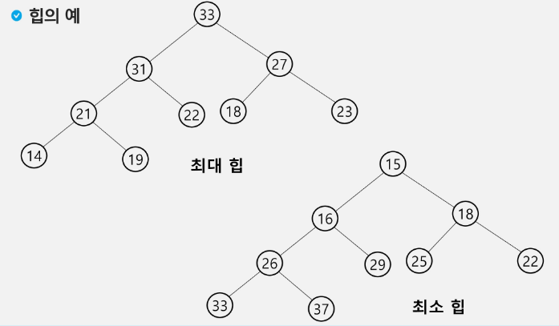
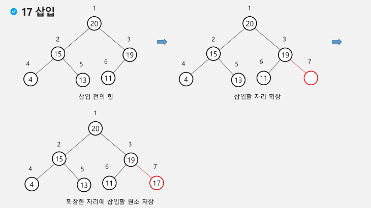
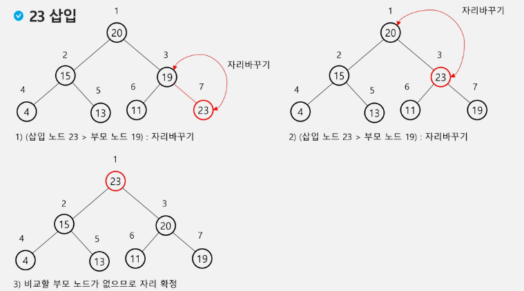
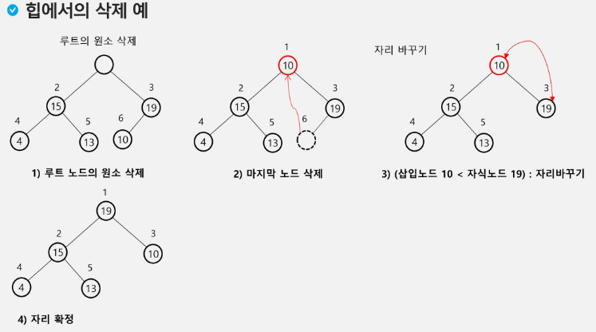

# 힙(heap) 🌸

> ## 개념
> 
> - **완전 이진트리**에 있는 노드 중에서 키 값이 가장 큰 노드나 키 값이 가장 작은 노드를 찾기 위한 자료구조
> - 부모의 값이 무조건 자식보다 커야함
> - ***우선 순위가 가장 높은 데이터부터 확인 할 수 있음 => 우선순위 큐를 구현할 수 있음***

### 삽입
>
>
> - 맨 뒤 삽입 후 내 위치를 찾아감(비교 -> swap)
> - 시간복잡도 : O(log N) + a

### 삭제
> 
> - 루트노드와 마지막 노드 자리를 바꾼 후 마지막 노드를 삭제 -> 그 후 루트 노드에서 자리를 찾아가는 형식
> - max heap: 자리 바꿀때는 오른쪽 노드에서 가장 작은 값과 swap
> - 루트 노드의 원소만을 삭제할 수 있다.
> - 루트 노드의 원소를 삭제하여 반환
> - 힙의 종류에 따라 최대값, 최소값을 구할 수 있다.
> - 시간복잡도 : O(log N) + a

> - N개의 데이터를 힙으로 만들기: N * log N