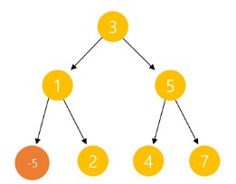

# 트리(Tree) 🌳

> ### 개념
> - 비선형 구조
> - 원소들 간에 1 : N 관계를 가지는 자료구조
> - 원소들 간에 계층관계를 가지는 계층형 자료구조
> - 상위 원소에서 하위 원소로 내려가면서 확장되는 트리모양의 구조
> - **트리는 형제 노드끼리 연결할 수 없어서 사이클이 존재하지 않음, 위아래가 존재**

> - 한 개 이상의 노드로 이루어진 유한 집합
> - 부트리 T1, T2 ... TN은 각각 하나의 트리이며(재귀적 정의) 루트의 부트리라 함
---
---
 

> - 노드 : 트리의 원소 [트리 T의 노드 : A B C D E F G H I J K]
> - 간선 : 노드를 연결하는 선, 부모-자식 노드를 연결
> - 루트 노드 : 트리의 시작 노드 [트리 T의 루트 노드 : A]
> - 형제 노드 : 같은 부모 노드의 자식 노드 [B C D는 형제 노드]
> - 조상 노드 : 간선을 따라 루트 노드까지 이르는 경로에 있는 모든 노드 [K의 조상 노드 : F B A]
> - 자손 노드 : 서브 트리의 하위 레벨의 노드들 [B의 자손 노드: E F K]

> - 차수 : 노드에 연결된 자식 노드의 수
> [B의 차수 : 2, C의 차수 : 1]
> - 트리의 차수 : 트리에 있는 노드의 차수 중 가장 큰 값
> [트리 T차수 : 3]
> - 단말 노드: 차수가 0인 자식 노트가 없는 노드
> [트리 T의 단말 노드 : E K G H I J]

> - 노드의 높이 : 루트에서 노드에 이르는 간선의 수, 노드의 레벨
> - 트리의 높이 : 트리에 있는 노드의 높이 중에서 가장 큰 값, 최대 레벨

---
---
# binary tree 🌳

> - 모든 노드들이 2개의 서브트리를 갖는 형태
> - 자식 노드를 최대한 2개까지만 가질 수 있는 트리[left child node / right child node]

> 
> - 레벨 i에서 노드의 최대 개수는 2 ** i개 [1 2 4 8 16 ...]
> - i층까지 최대 노드의 합 : (2 ** (i+1)) - 1 
> - 높이가 h인 이진트리가 가질 수 있는 노드의 최소 개수 : h + 1
> - 이진 트리가 가질 수 있는 최대 노드 수: (2 ** (i+1)) - 1 

> 
> - **포화 이진트리(Full Binary Tree)**
> - 모든 노드의 자식이 2개

> 
> - **완전 이진 트리(Complete Binary Tree)**
> - 순서대로 왼쪽 - 오른쪽이 잘 들어간 트리

> 
> - **평향 이진 트리(Skewed Binary Tree)**

> - **이진 트리** -> 순서대로 삽입: **완전 이진 트리** -> 안정적인 상태로 보임(꽉 차면): **포화 이진 트리**

---
---

# 이진 트리 - 순회(traversal) 🌳

> - 순회 : 트리의 각 노드를 중복되지 않게 전부 방문하는 것
> - 트리는 비 선형 구조이기 때문에 선형구조에서와 같이 선후 연결 관계를 알 수 없음

> 
> - ** 전위 순회(preorder traversal)**
> - 부모노드 방문 후, 자식 노드를 왼쪽 - 오른쪽 순서로 방문

> 
> - ** 중위 순회(inorder traversal)**
> - 왼쪽 자식노드, 부모노드, 오른쪽 자식 노드 순으로 방문

> 
> - ** 후위 순회(inorder traversal)**
> - 자식 노드를 왼쪽 - 오른쪽 순서로 방문한 후, 부모노드로 방문 

> 
> - 전위 순회 : A B D H I E J C F K G L M
> - 중위 순회 : H D I B J E A F K C L G M
> - 후위 순회 : H I D J E B K F L M G C A

---
---
# 이진 트리 (배열을 이용한 표현) 🌳

> - 
> - 루트의 번호가 1일때 기준으로 N(부모 노드), 2*i(왼쪽 자식 노드) 2*i+1(오른쪽 자식 노드)

---
---
# BST(binary search tree) 자료구조 🌴

> - 데이터를 빠르게 검색할 수 있도록 체계적으로 저장, O(log n)의 빠른 속도로 값을 검색가능
>   - log n은 1억개의 데이터도 27번만에 찾을 수 있음
>   - 내 위치를 찾기 위해 높이만큼만 비교하면 되기 때문에 log n의 시간 복잡도를 가진다.
> - 탐색, 추가, 삭제가 효율적으로 구성

## 리스트 vs BST
> - 리스트보다 더 빠른 삽입, 삭제, 탐색 가능 
> - [리스트 : O(n),맨 끝 삽입 삭제는 O(1)]  vs [BST : 평균 O(logN)]

> 
> - 삽입을 위해, 루트부터 바닥 노드까지 탐색
> - 탐색 시간 : 트리의 높이(h)
> - 2^높이 = 노드 수(N) => log N = h
> - **정렬되어(편향되어) 들어오는 데이터** => 리스트와 다른 점이 없음 O(N)
> - 시간 = 높이 (log N ~ N)의 값을 가진다

> - BST에서 DFS 중위순회를 하게 되면 Key 값이 작은 순서대로 탐색가능
> - 오름차순으로 정렬된 데이터를 얻을 수 있음.

> 
> - BST 규칙을 유지하며 삭제 연산 도전 (13, 12, 9 삭제하기)
> - 1. 리프 노드는 삭제해도 문제 x (13 삭제)
> - 2. 자식이 하나일 때, 자식 - 부모 연결 후 삭제 (9 - 15 연결, 12 삭제)
> - 3. 반으로 나눴을 때, 자식이 둘이라면 왼쪽 서브트리의 가장 큰 값 or오른쪽 서브트리의 가장 작은 값 (9 삭제, 6 or 12 넣기)
> - ***지우려는 노드를 탐색(높이에 비례)하고 삭제(상수번 만큼)하기 때문에 logN***

### 정리 🍀

> 
> - 탐색에 효율적
> - 모든 원소는 서로 다른 유일 키를 갖는다 (문제마다 다를 수 있음)
> - key (왼쪽 서브트리) < key (루트노드) < key (오른쪽 서브트리)
> - 왼쪽 서브트리와 오른쪽 서브트리도 BST
> - 중위 순호하면 오름차순으로 정렬도니 값을 얻을 수 있다.