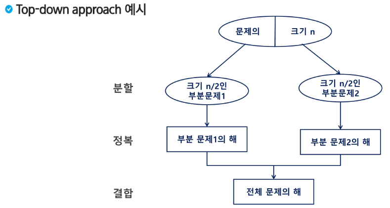
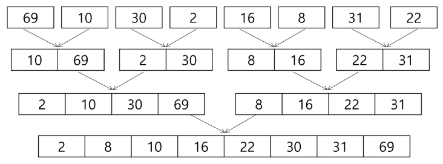
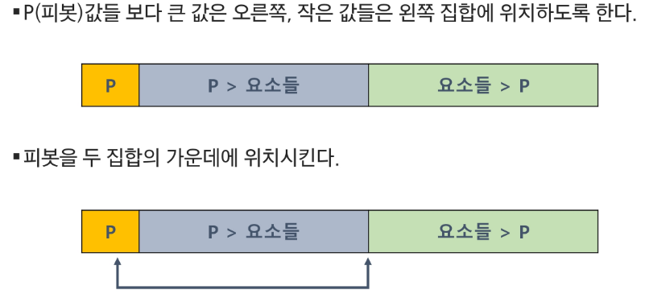

#  분할 정복 기법(Divide and Conquer) ✨

> ### 설계 전략
> - 분할 (Divide): 해결할 문제를 여러 개의 작은 부분으로 나눈다.
> - 정복 (Conquer): 나눈 작은 문제를 각각 해결한다.
> - 통합 (Combine): (필요하다면) 해결된 해답을 모은다.
>
>

---
---
#  병합 정렬(Merge Sort) ✨

> ### 개념
> - 여러 개의 정렬된 자료의 집합을 병합하여 한 개의 정렬된 집합으로 만드는 방식
> - 자료를 최소 단위의 문제까지 나눈 후에 차례대로 정렬하여 최종 결과를 얻어냄.
> - 외부 정렬 (External Sort)의 기본이 되는 정렬 
> - 멀티코어 CPU나 다수의 프로세서에서 정렬 알고리즘을 병렬화하기 위해 사용됨

> 
> - 원소 1개일 때까지 반씩 나눔 => 분할 과정: log n번, 모든 원소를 병합단계에서 비교 (N번)
> - 시간 복잡도 : O(n log n)


> - 분할과 병합의 과정만 존재함 (정복:나누면 자연스레 정렬됨)
```
def merge_sort(m):
    # 리스트의 길이가 1이면 이미 정렬된 상태이므로 그대로 반환
    if len(m) == 1:
        return m

    # 리스트를 절반으로 나누기 위해 중간 인덱스를 계산
    mid = len(m) // 2
    left = m[:mid]  # 리스트의 앞쪽 절반
    right = m[mid:]  # 리스트의 뒤쪽 절반

    # 재귀적으로 왼쪽 부분과 오른쪽 부분을 정렬
    left = merge_sort(left)
    right = merge_sort(right)

    # 두 개의 정렬된 리스트를 병합하여 반환
    return merge(left, right)


def merge(left, right):
    # 두 리스트를 병합할 결과 리스트를 초기화
    result = [0] * (len(left) + len(right))
    l = r = 0  # 왼쪽 리스트와 오른쪽 리스트의 인덱스

    # 두 리스트를 순차적으로 비교하여 작은 값을 결과 리스트에 추가
    while l < len(left) and r < len(right):
        if left[l] < right[r]:
            result[l + r] = left[l]
            l += 1
        else:
            result[l + r] = right[r]
            r += 1

    # 왼쪽 리스트에 남은 요소들을 결과 리스트에 추가
    while l < len(left):
        result[l + r] = left[l]
        l += 1

    # 오른쪽 리스트에 남은 요소들을 결과 리스트에 추가
    while r < len(right):
        result[l + r] = right[r]
        r += 1

    # 병합된 결과 리스트를 반환
    return result


arr = [69, 10, 30, 2, 16, 8, 31, 22]
arr = merge_sort(arr)
print(arr)
   
```

---
---
#  퀵 정렬(Quick Sort) ✨

> ### 개념
> - 주어진 배열을 두 개로 분할하고, 각각을 정렬한다.
> - 병합 정렬은 그냥 두 부분으로 나누는 반면, 퀵 정렬은 분할할 때, 기준 아이템 중심으로 분할한다.
>   - 기준보다 작은 것은 왼편, 큰 것은 오른편에 위치
> - 각 부분은 정렬이 끝난 후, 병합정렬은 '병합'이란 후처리 작업이 필요하나, 퀵정렬은 필요로 하지 않는다.
> - 매우 큰 입력 데이터에 대해서 좋은 성능을 보인다.

> 

```
arr = [3, 2, 4, 6, 9, 1, 8, 7, 5]


def lomuto_partition(left, right):
    pivot = arr[right]

    i = left - 1
    for j in range(left, right):
        if arr[j] <= pivot:
            i += 1
            arr[i], arr[j] = arr[j], arr[i]

    arr[i + 1], arr[right] = arr[right], arr[i + 1]
    return i + 1


def quick_sort(left, right):
    if left < right:
        pivot = lomuto_partition(left, right)
        quick_sort(left, pivot - 1)
        quick_sort(pivot + 1, right)


quick_sort(0, len(arr) - 1)
print(arr)
```

---
---

#  이진 검색(Binary Search) ✨

> ### 개념
> - 자료의 가운데에 있는 항목의 키 값과 비교하여 다음 검색의 위치를 결정하고 검색을 계속 진행하는 방법
>   - 목적 키를 찾을 때까지 이진 검색을 순환적으로 반복 수행함으로써 검색 범위를 반으로 줄여나가면서 보다 빠르게 검색을 수행함
> - ❗ 이진 검색을 하기 위해서는 자료가 정렬된 상태여야 한다.
> - 특정 데이터의 점위 검색에서 활용됨
> - 시간 복잡도 : log n


> ### 검색 과정
> - 1. 자료의 중앙에 있는 원소를 고른다
> - 2. 중앙 원소의 값과 찾고자 하는 목표의 값을 비교한다.
> - 3. 목표 값이 중앙 원소의 값보다 작으면 자료의 왼쪽 반에 대해서 새로 검색을 수행하고, 크다면 자료의 오른쪽 반에 대해서 새로 검색을 수행한다.
> - 4. 찾고자 하는 값을 찾을 때까지 1~3의 과정을 반복한다.

> - 정렬 : O(N log N), 시간 복잡도 : O(log N)
```
arr = [2, 4, 7, 9, 11, 19, 23]
# 이진 탐색은 정렬된 데이터에 적용 가능하다.
# arr.sort()


def binary_search(low, high, target):
    # 기저조건
    # target 을 발견하지 못하면 종료
    if low > high:
        return -1

    mid = (low + high) // 2

    # 발견했다면
    if target == arr[mid]:
        return mid

    # target 이 mid 보다 작다 == target 이 mid 의 왼쪽에 존재한다 == high 를 mid - 1로
    elif target < arr[mid]:
        return binary_search(low, mid - 1, target)
    else:
        return binary_search(mid + 1, high, target)


print(f'9 = {binary_search(0, len(arr) - 1, 9)}')
print(f'2 = {binary_search(0, len(arr) - 1, 2)}')
print(f'20 = {binary_search(0, len(arr) - 1, 20)}')

```
