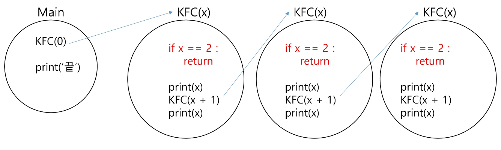
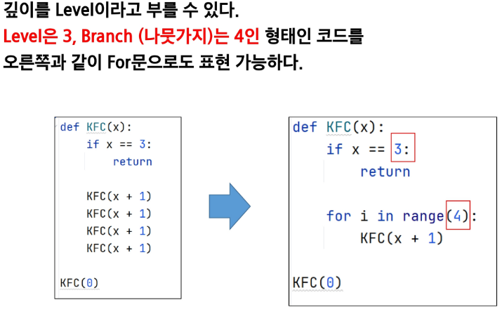
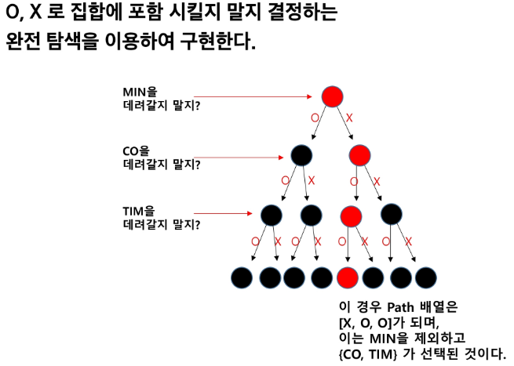
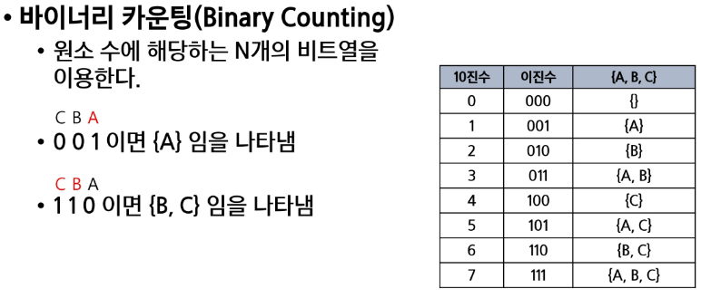
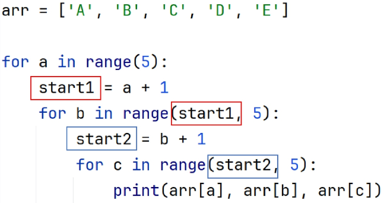

# 재귀(Recursion) 🎡

> ### 개념
> - KFC 함수 호출할 때, int 타입 객체를 전달하면 값만 복사 된다.
> 
> 

---
---

# 순열(Permutation) 🎡

> ### 개념
> -  서로 다른 N개에서 R개를 중복없이, 순서를 고려하여 나열하는 것.
> -  중복을 취급하지 않는다.
> -  중복을 취급하지 않는 순열은 전역 **리스트**를 사용
> -  used 배열 또는 visited 배열 사용

> ### 중복순열
> - 서로 다른 N개에서 R개를 중복을 허용하고, 순서를 고려하여 나열하는 것.

> ### 구현 원리
> - 재귀 호출 할 때마다, 이동 경로를 흔적으로 남긴다.
> - 가장 마지막 레벨에 도착했을 때, 이동 경로 (흔적)를 출력한다.

```
# 경로를 기록할 리스트
path = [] 
# 사용 여부를 기록할 리스트
visited = [False] * 7

# 0부터 시작, 3개를 뽑은 경우 종료
def permutation(x):
    if x == 3:
    print(*path)
    return
    
    # 2. 후보군을 반복하면서
    for i in range(1, 7):
        # (중복제거 순열, i가 이미 뽑혔다면, continue)
        # in => O(len(path)) => 브랜치가 많을 경우에는 시간초과    
        if i in path: continue
    
        # 이미 뽑혔다면, continue
        if visited[i]: continue
    
        # 2-1. 재귀 호출 전 - 경로 기록 + 사용기록
        visited[i] = True
        path.append(i)
        # 2-2. 다음 재귀 호출(파라미터 전달)
        permutation(x+1)
        # 2-3. 돌아왔을 때 - 사용했던 경로 삭제 + 사용 여부 초기화
        visited[i] = False
        path.pop()

permutation(0)
```
---
---
# 완전탐색(Brute-Force) 🎡

> ### 개념
> - 모든 가능한 경우를 모두 시도해보고, 정답을 찾아내는 알고리즘

> ### 문제
> - 주사위 눈금의 합
> - 3개의 주사위(서로 영향이 없는 '독립적인 존재'- 즉, 다른 숫자와 영향을 주지 않음)를 던져 나올 수 있는 중복 순열에 대해, 합이 10 이하가 나오는 경우의 수
> - 기저조건 : 주사위 3개를 던졌을 때, 후보군: 1~6

```
# 주사위 몇 개 던졌는지, 주사위의 합이 몇인지 ?
def recur(level, total):
    #  가지치기 : 이미 10을 넘는 경우의 수는 계산할 필요가 없다 !(백트래킹)
    if total > 10: return
    
    # 기저조건: 3개를 던졌을 때 종료
    if level == 3:
        # 10 이하인가?
        if total <= 10: print(path)
        return
        
    # 후보군 탐색
    for i in range(1, 7):
        # i의 의미: 주사위 숫자
        path.append(i)
        # 주사위 결과를 더하여 전달
        recur(level + 1, total + i)
        path.pop()

recur(0, 0)
```

# 부분 집합 ✨

> ### 개념
> - 집합에 포함된 원소들을 선택하는 것
 
> 
> - 1. 완전 탐색 (재귀 호출을 이용한 완전 탐색)

```
arr = ['O', 'X']
path = []
name = ['A', 'B', 'C']

def print_name():
    print('{', end = '')
    for i in range(3):
        if path[i] == 'O':
            print(name[i], end=' ')
    print('}')

def rum(level):
    if level == 3:
        print(path)
        return
       
    for i in range(2):
        path.append(arr[i])
        run(level + 1)
        path.pop()

run(0)
```

> 
> - 2. Binary Counting (2진수 & 비트 연산을 이용)

```
arr = ['A', 'B', 'C']
n = len(arr)

def get_sub(tar):
    for i in range(n):
        if tar & 0x1:
            print(arr[i], end='')
        tar >>= 1

for tar in range(0, 1 << n):
    print('{')
    get_sub(tar)
    print('}')
```

#  조합 ✨

> ### 개념
> - 서로 다른 n개의 원소 중에서 r개를 순서 없이 골라낸 것
> - {A B C} == {A C B}, 조합에서는 동일하다 봄 (순열은 다르다고 봄)


> 
```
for i in range(5):
    # N번을 뽑았다면 
    for j in range(N+1, 5):
        # M번을 뽑았다면
        for k in range(M+1, 5)
        
arr = ['a', 'b', 'c', 'd', 'e']
path = []
n = 3

def run(level, start):
    if level == n:
        print(*path)
        return
    
    for i in range(start, 5):
         path.append(arr[i])
         run(level + 1, i + 1)
         path.pop()

run(0, 0)
```


#  Greedy ✨

> ### 개념
> - 결정이 필요할 때 가장 좋아보이는 선택지로 결정하는 알고리즘
> - 완전 탐색이 되지 않을 때 고려해볼만한 기법

> ### 핵심 조건
> - 탐욕적 선택 조건 : 각 단계의 선택이 이후 선택에 영향을 주지 않는다.
> - 최적 부분 구조 : 각 단계의 최선의 선택이, 전체 문제의 최선의 해가 된다.
> - 각 단계의 최적을 구했지만 모든 것이 최적해가 될 수 있는가 ? (반례를 찾아나가는 것이 증명단계)

> - 1. 각 단계에서 최적해를 찾아야 한다.
> - 2. 단계의 결과들을 합하는 방법을 찾아야 한다.
> - 3. 각 단계의 합 == 전체 문제의 합이라는 것을 증명해야 한다.

